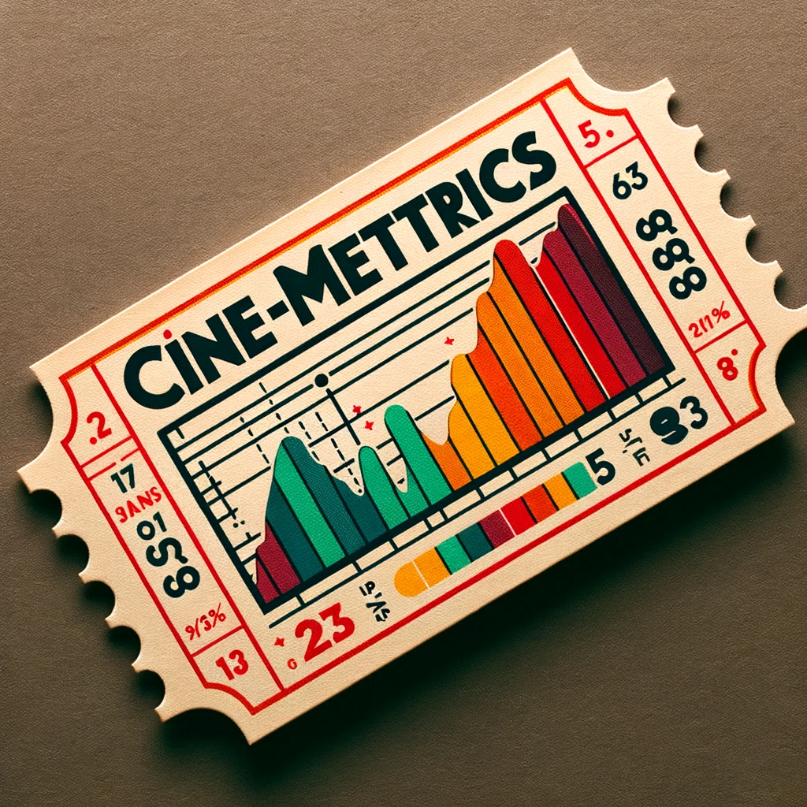

# MGSC 661 - Midterm Project



## Table of Contents

- [MGSC 661 - Midterm Project](#mgsc-661---midterm-project)
  - [Table of Contents](#table-of-contents)
  - [Introduction](#introduction)
  - [Getting Started](#getting-started)
  - [Data Description](#data-description)
  - [Deliverables](#deliverables)

## Introduction

**The final report can be found [here](./deliverables/midterm_cinemettrics.pdf).**

This repository contains the code by Group 3 for the 2023 IMDb Rating Prediction Project. The goal is to predict the IMDb ratings of the twelve upcoming blockbusters.

After data preprocessing and exploratory data analysis, we fit three regression models to predict the IMDb ratings. We then compare the performance of these models to select the best one.

## Getting Started

1. **Clone the repo**:

   ```git
   git clone https://github.com/lakshyaag/MGSC-661-Midterm-Project
   ```

2. Navigate to the data directory to view the dataset and the data dictionary.
3. Check out `final_code.Rmd` for the main codebase of the project.
4. View our reports and deliverables in the `deliverables` folder.

## Data Description

The dataset contains details of ~2000 movies. The attributes in the dataset include:

- **Budget**: The production budget of the movie.
- **Duration**: The runtime of the movie in minutes.
- **Actors**: List of main actors in the movie.
- **Genre**: Genre(s) of the movie.
- **Language**: Original language of the movie.
- And many more...

For a comprehensive description of all the attributes, refer to `data/data_dictionary_IMDb_Fall_2023.csv`.

## Deliverables

All project-related deliverables can be found in the `deliverables` folder. This includes various plots, tables, and reports that provide insights into our analysis and findings.

---

Feel free to explore the repository. Your feedback and contributions are always welcome!
